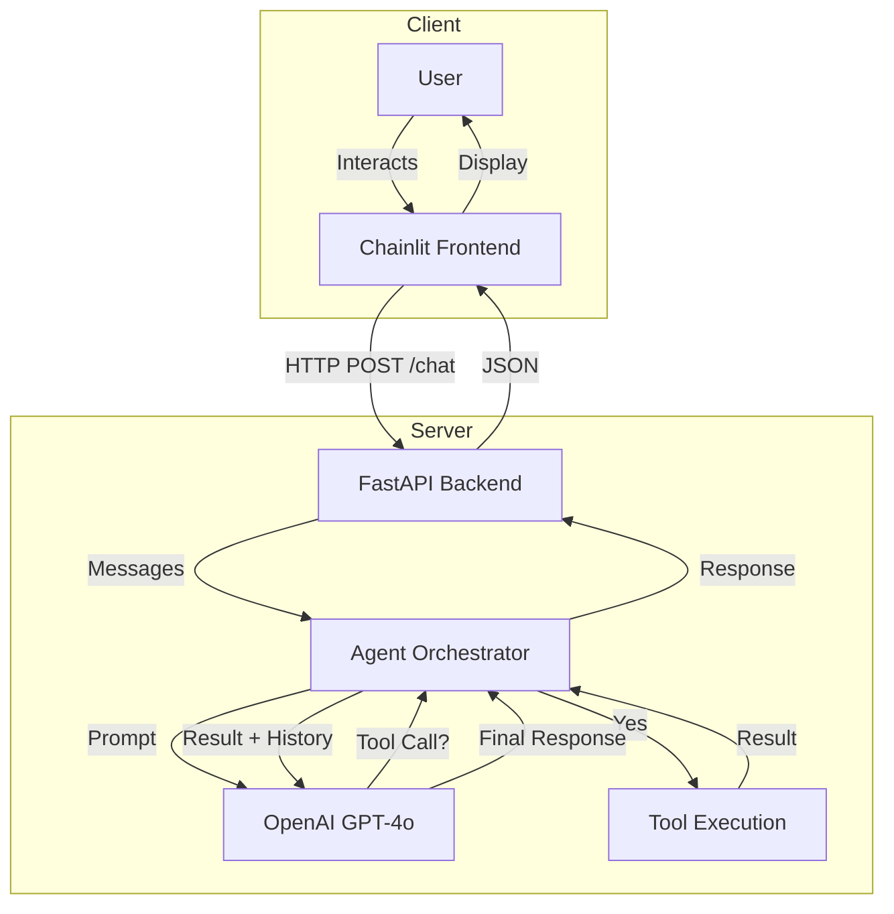

# Customer Support Agent

An autonomous customer support agent built with Python, OpenAI, and Chainlit. The agent leverages OpenAI's function calling capabilities to intelligently handle customer queries, check order statuses, and escalate issues when necessary, all within a modular Client-Server architecture.

## Features

- **Autonomous Agent**: Uses OpenAI's GPT-4.1 mini to understand and resolve user queries.
- **Tool Usage**: Can fetch order status from a mock database and escalate issues.
- **Guardrails**: Prevents the agent from answering off-topic questions (e.g., coding, math).
- **Observability**: Logs token usage and latency for every agent execution.
- **Modern UI**: Built with Chainlit for a chat-like experience.
- **Modular Architecture**: Clean separation of concerns with a `src/` layout and Client-Server split.

## Architecture

The application follows a Client-Server architecture where the Chainlit frontend communicates with a FastAPI backend. The backend orchestrates the AI agent, which interacts with OpenAI and executes tools.



## Project Structure

```
cloudstok-assignment/
├── main.py                # FastAPI Backend entry point
├── app.py                 # Chainlit Frontend entry point
├── verify_agent.py        # CLI verification script
├── docker-compose.yml     # Multi-container setup
├── ...
```

## Setup

1.  **Clone the repository**
2.  **Create a virtual environment and install dependencies using uv**:
    ```bash
    pip install uv
    uv venv
    # Activate venv...
    uv sync
    ```
3.  **Configure Environment**:
    - Copy `.env.example` to `.env`
    - Add your `OPENAI_API_KEY`

## Usage

### Run with Docker Compose (Recommended)
This will start both the Backend (port 8000) and Frontend (port 8001).

```bash
docker-compose up --build
```

Access the UI at: `http://localhost:8001`

### Run Locally (Manual)
You need two terminals:

1.  **Start Backend**:
    ```bash
    uv run uvicorn main:app --reload
    ```
2.  **Start Frontend**:
    ```bash
    uv run chainlit run app.py -w
    ```

### API Usage

You can interact with the backend API directly using `curl` or any HTTP client.

**Endpoint**: `POST http://localhost:8000/chat`

**Request Body**:
```json
{
  "messages": [
    {"role": "user", "content": "Where is my order 123?"}
  ]
}
```

**Example (curl)**:
```bash
curl -X POST http://localhost:8000/chat \
  -H "Content-Type: application/json" \
  -d '{"messages": [{"role": "user", "content": "Hello"}]}'
```

