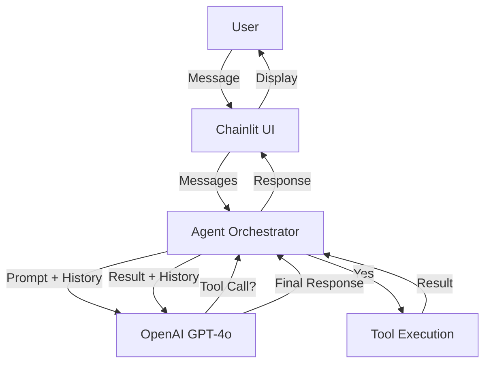

# Customer Support Agent

An autonomous customer support agent built with Python, OpenAI, and Chainlit. The agent uses a "Swarm-like" pattern to handle customer queries, check order statuses, and escalate issues when necessary.

## Features

- **Autonomous Agent**: Uses OpenAI's GPT-4.1 mini to understand and resolve user queries.
- **Tool Usage**: Can fetch order status from a mock database and escalate issues.
- **Guardrails**: Prevents the agent from answering off-topic questions (e.g., coding, math).
- **Observability**: Logs token usage and latency for every agent execution.
- **Modern UI**: Built with Chainlit for a chat-like experience.
- **Modular Architecture**: Clean separation of concerns with a `src/` layout.

## Architecture

The data flow is simple: User -> Chainlit UI -> Agent -> LLM (OpenAI) -> Tools -> Agent -> UI.



## Project Structure

```
cloudstok-assignment/
├── app.py                 # Chainlit entry point
├── verify_agent.py        # CLI verification script
├── requirements.txt       # Dependencies
├── .env                   # Environment variables
└── src/
    ├── agents/
    │   ├── agent.py       # Core Agent logic
    │   └── prompts.py     # System prompts & guardrails
    ├── tools/
    │   └── tools.py       # Mock tools (get_order_status, etc.)
    ├── schemas/
    │   └── models.py      # Pydantic models
    └── helpers/
        └── utils.py       # Logging & decorators
```

## Setup

1.  **Clone the repository**
2.  **Create a virtual environment and install dependencies using uv**:
    ```bash
    pip install uv
    uv venv
    # On Windows
    .venv\Scripts\activate
    # On macOS/Linux
    source .venv/bin/activate
    
    uv pip install -r requirements.txt
    ```
4.  **Configure Environment**:
    - Copy `.env.example` to `.env`
    - Add your `OPENAI_API_KEY`

## Usage

### Run the UI
```bash
uv run chainlit run app.py
```
